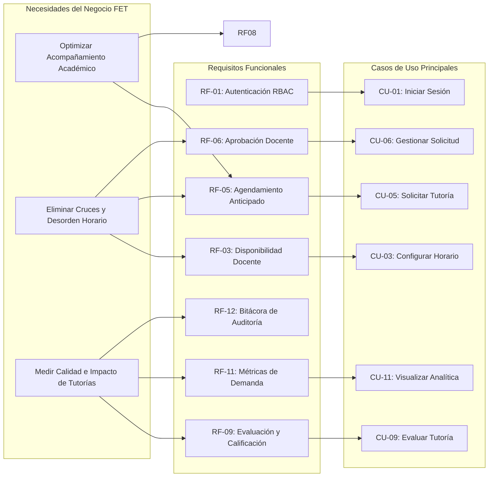
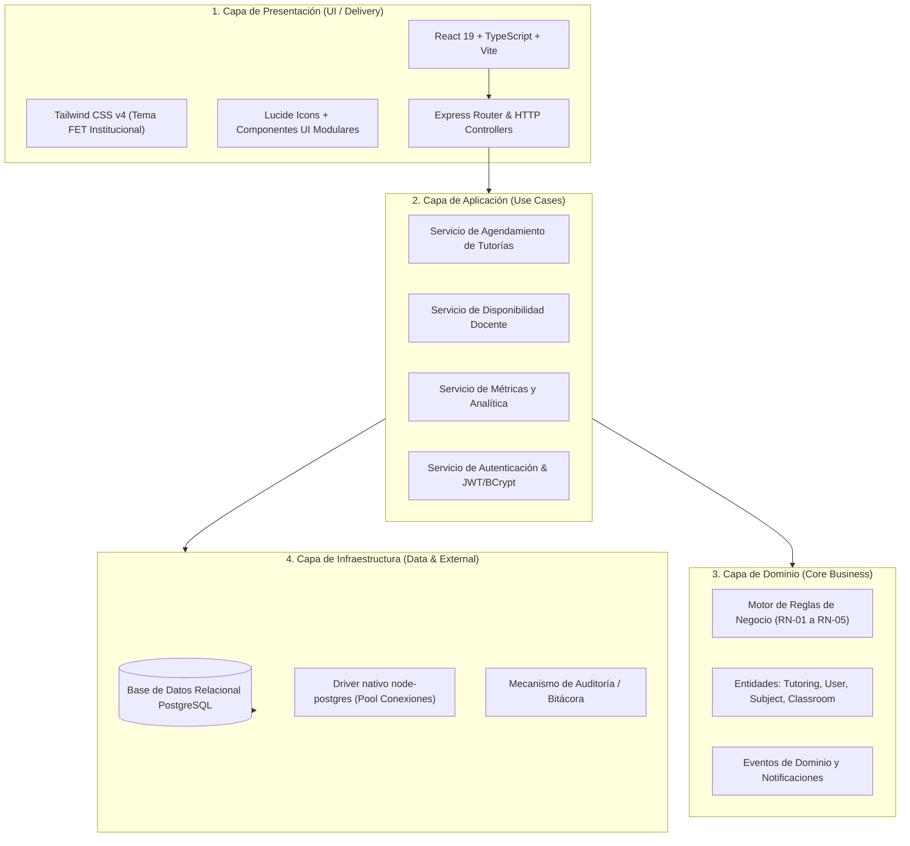
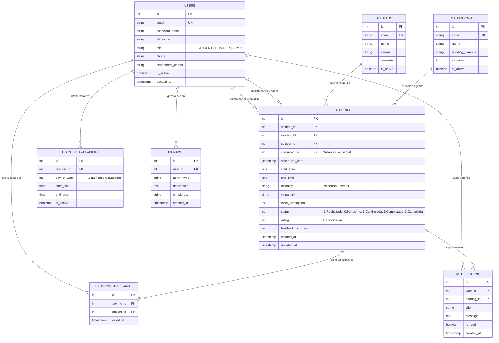
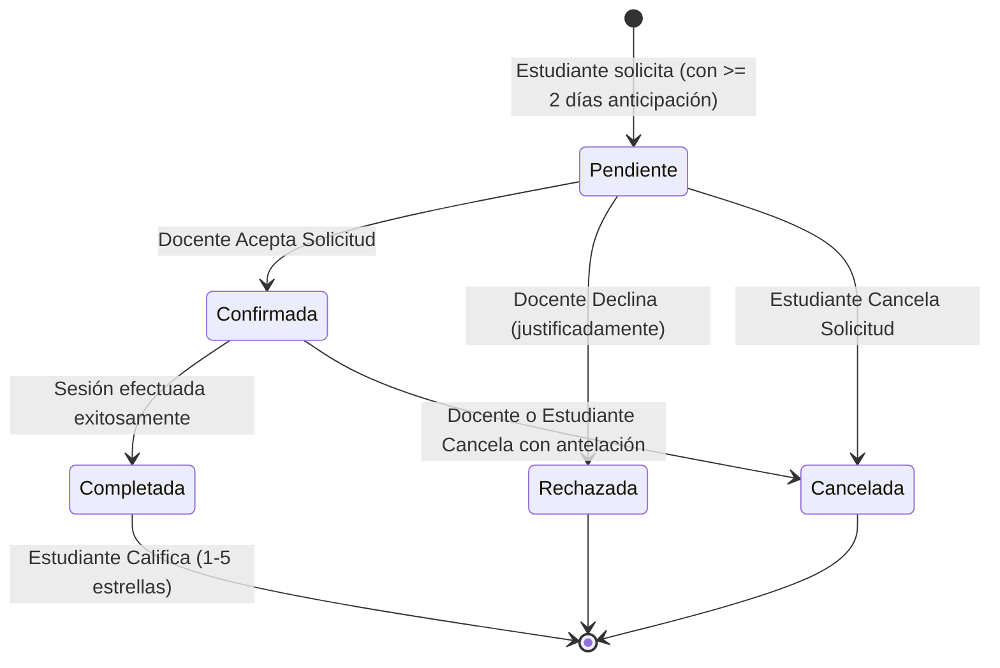

# DOCUMENTO DE ESPECIFICACIÓN RUP (RATIONAL UNIFIED PROCESS)
## Sistema de Información: "Agendamientos Tutorías FET"
### Fundación Escuela Tecnológica de Neiva - FET
**Facultad de Ingeniería y Ciencias Aplicadas / Bienestar Institucional**  
**Versión del Documento:** 1.0  
**Fecha:** Septiembre 2026  
**Estado:** Aprobado / En Producción  

---

## ÍNDICE GENERAL

1. [FASE DE INICIO (INCEPTION)](#1-fase-de-inicio-inception)
   - 1.1. Visión y Propósito del Proyecto
   - 1.2. Oportunidad de Negocio y Planteamiento del Problema
   - 1.3. Objetivos del Sistema (General y Específicos)
   - 1.4. Alcance del Sistema (In-Scope y Out-of-Scope)
   - 1.5. Partes Interesadas (Stakeholders) y Actores del Sistema
   - 1.6. Supuestos, Restricciones y Factores Críticos de Éxito
2. [FASE DE ELABORACIÓN (ELABORATION)](#2-fase-de-elaboración-elaboration)
   - 2.1. Reglas de Negocio del Sistema (Invariantes)
   - 2.2. Especificación de Requisitos Funcionales (RF)
   - 2.3. Especificación de Requisitos No Funcionales (RNF)
   - 2.4. Matriz de Trazabilidad de Requisitos
   - 2.5. Modelo y Catálogo de Casos de Uso (CU)
     - Diagrama General de Casos de Uso
     - Especificaciones Detalladas de Casos de Uso Críticos
   - 2.6. Modelo de Dominio y Glosario de Términos
3. [FASE DE CONSTRUCCIÓN (CONSTRUCTION)](#3-fase-de-construcción-construction)
   - 3.1. Arquitectura de Software (Modelo 4+1 Vistas)
     - Vista Lógica (Clean Architecture en 4 capas)
     - Vista de Implementación y Stack Tecnológico
     - Vista de Procesos y Concurrencia
     - Vista de Despliegue (Infraestructura de Servidor y BD)
     - Vista de Casos de Uso (Realización de Arquitectura)
   - 3.2. Modelo de Datos Relacional (PostgreSQL)
     - Diccionario de Datos Exhaustivo
     - Diagrama Entidad-Relación (ERD)
   - 3.3. Ciclo de Vida y Máquina de Estados de la Tutoría
   - 3.4. Interfaces de Integración (API REST Endpoints)
   - 3.5. Seguridad, Cifrado y Control de Acceso (RBAC)
4. [FASE DE TRANSICIÓN (TRANSITION)](#4-fase-de-transición-transition)
   - 4.1. Plan de Aseguramiento de Calidad y Pruebas (QA)
     - Pruebas Automatizadas de Reglas de Negocio
     - Matriz de Pruebas de Integración y Regresión
   - 4.2. Procedimientos de Despliegue e Instalación
   - 4.3. Plan de Contingencia, Respaldos y Recuperación
   - 4.4. Guía de Operación y Manual de Roles de Usuario
   - 4.5. Métricas de Impacto y Conclusiones

---

# 1. FASE DE INICIO (INCEPTION)

### 1.1. Visión y Propósito del Proyecto
El sistema **"Agendamientos Tutorías FET"** es una solución integral y centralizada orientada a la gestión, programación, ejecución, control y auditoría del proceso de acompañamiento académico y tutorías universitarias en la **Fundación Escuela Tecnológica de Neiva - FET** (Huila, Colombia). 

El propósito primordial es erradicar los procesos manuales e informales de agendamiento, garantizando el cumplimiento estricto de los horarios docentes, la disponibilidad de aulas físicas en campus y enlaces virtuales, facilitando la colaboración entre pares estudiantiles y proporcionando a la Dirección Académica y Bienestar Universitario trazabilidad en tiempo real sobre el rendimiento e impacto de las asesorías.

### 1.2. Oportunidad de Negocio y Planteamiento del Problema
Históricamente en las instituciones de educación superior, el proceso de tutorías académicas experimenta las siguientes dificultades operativas:
- **Colisiones horarias:** Profesores asignados a más de una tutoría o clase regular en la misma franja horaria.
- **Falta de anticipación:** Solicitudes espontáneas que no permiten al docente preparar el material pedagógico de refuerzo.
- **Desperdicio de espacios físicos:** Falta de control sobre salones y laboratorios en el campus, ocasionando que dos docentes concurran al mismo espacio físico.
- **Opacidad en métricas:** Ausencia de registros confiables sobre qué asignaturas presentan mayor índice de reprobación o demanda de tutorías, limitando la toma de decisiones oportunas para mitigar la deserción escolar.
- **Aislamiento del estudiante:** Limitaciones para que estudiantes que comparten dudas en la misma materia puedan sumarse a una sesión ya concedida.

### 1.3. Objetivos del Sistema
#### 1.3.1. Objetivo General
Desarrollar e implantar un sistema de información web transaccional y analítico bajo principios de Clean Architecture y la metodología RUP, que centralice y optimice el ciclo de vida de las tutorías presenciales y virtuales en la FET.

#### 1.3.2. Objetivos Específicos
1. Automatizar la solicitud y confirmación de tutorías garantizando una anticipación mínima obligatoria de 2 días calendario.
2. Validar algorítmicamente la inexistencia de colisiones de horario docente y cruces de aulas físicas en el campus.
3. Permitir la inscripción multiestudiantil colaborativa en sesiones abiertas según el cupo máximo definido.
4. Proveer un canal de evaluación bidireccional (calificación por estrellas y retroalimentación) para medir la efectividad pedagógica.
5. Suministrar un panel gerencial para el Administrador con métricas fidedignas de asistencia, demanda por asignaturas del pénsum activo y registro de auditoría (bitácora inmutable).

### 1.4. Alcance del Sistema
#### 1.4.1. Alcance Incluido (In-Scope)
- Autenticación segura y registro con control de acceso basado en roles (**RBAC**: Estudiante, Docente, Administrador).
- Gestión del catálogo académico: Carreras, Asignaturas vigentes, Salones/Laboratorios y Franjas Horarias institucionales.
- Módulo de Disponibilidad Docente configurable por día y bloque horario.
- Módulo de Reserva de Tutorías con validación preventiva de reglas de negocio en frontend y backend.
- Flujo de estados: *Pendiente de Confirmación*, *Confirmada*, *Completada*, *Rechazada*, *Cancelada*.
- Módulo de Asistentes Colectivos (inscripción de compañeros a tutorías activas).
- Módulo de Calificación y Feedback posterior a la finalización de la sesión.
- Centro de Notificaciones en tiempo real para eventos de agendamiento, aprobación o cancelación.
- Tablero analítico para Dirección Académica con reportes de demanda, efectividad y bitácora de transacciones.

#### 1.4.2. Fuera del Alcance (Out-of-Scope)
- Procesamiento de pagos o liquidaciones de nómina docente por horas de tutoría.
- Emisión formal de notas curriculares oficiales (el sistema es de acompañamiento tutorial, no sustituye el Sistema de Calificaciones Institucional).
- Servicio de videoconferencia embebido propio (se integra mediante enlaces dinámicos a Google Meet, Zoom o Microsoft Teams).

### 1.5. Partes Interesadas (Stakeholders) y Actores del Sistema

| Actor / Stakeholder | Descripción y Responsabilidad en el Negocio |
| :--- | :--- |
| **Estudiante FET** | Usuario que identifica deficiencias conceptuales en asignaturas matriculadas, consulta disponibilidad de docentes, solicita tutorías con mínimo 2 días de anticipación, asiste a las sesiones (presenciales o virtuales) y evalúa el servicio recibido. |
| **Docente FET** | Profesional académico que define sus bloques semanales de disponibilidad, evalúa y aprueba/rechaza solicitudes de tutoría, dicta las sesiones, registra la asistencia y consulta su historial pedagógico. |
| **Administrador / Coordinador Académico** | Responsable institucional que administra el catálogo de asignaturas, salones, usuarios, audita las bitácoras y analiza los indicadores de demanda y satisfacción institucional. |
| **Bienestar Institucional FET** | Dependencia institucional beneficiaria de los informes y estadísticas para la formulación de programas preventivos contra la deserción estudiantil. |
| **Sistema / Daemon de Notificaciones** | Proceso del sistema que actualiza estados automáticamente (ej. marcas de finalización o recordatorios) y despacha notificaciones a los perfiles. |

### 1.6. Supuestos, Restricciones y Factores Críticos de Éxito
- **Restricción Tecnológica:** El sistema debe operar en cualquier navegador moderno mediante arquitectura web responsive (Mobile First y Desktop).
- **Restricción de Integridad:** Ninguna reserva puede violar las 4 reglas cardinales de negocio sin importar si la petición procede de la UI o de llamadas directas al API REST.
- **Identidad Institucional:** La paleta de colores y componentes visuales debe respetar la identidad corporativa FET (Verde institucional `#059669`, Acentos Esmeralda `#10b981`, Índigo oscuro `#1e1b4b`, Slate neutros y soporte de Dark Mode integral).

---

# 2. FASE DE ELABORACIÓN (ELABORATION)

### 2.1. Reglas de Negocio del Sistema (Invariantes del Dominio)

```
+---------------------------------------------------------------------------------------------------+
| REGLAS CARDINALES DEL NEGOCIO (INVARIANTES FET)                                                   |
+---------------------------------------------------------------------------------------------------+
| RN-01: REGLA DE ANTICIPACIÓN MÍNIMA                                                               |
|        Toda solicitud de tutoría debe radicarse con al menos DOS (2) DÍAS CALENDARIO de           |
|        anticipación respecto a la fecha y hora de inicio de la sesión propuesta.                  |
|        Formula: (FechaInicioTutoria - FechaActual) >= 48 horas.                                    |
+---------------------------------------------------------------------------------------------------+
| RN-02: NO COLISIÓN DOCENTE                                                                        |
|        Un docente no puede tener más de una tutoría activa (Pendiente o Confirmada) o bloque      |
|        de clase simultáneo en la misma franja de fecha y hora.                                    |
+---------------------------------------------------------------------------------------------------+
| RN-03: NO COLISIÓN DE ESPACIO FÍSICO (AULA / LABORATORIO)                                         |
|        Si la modalidad de la tutoría es 'Presencial', el aula o laboratorio asignado no puede     |
|        estar ocupado por otra tutoría o actividad física en el mismo intervalo temporal.          |
+---------------------------------------------------------------------------------------------------+
| RN-04: CONCURRENCIA DE ASISTENTES (INSCRIPCIÓN DE PARES)                                          |
|        Múltiples estudiantes pueden inscribirse a una misma tutoría confirmada, siempre y cuando |
|        no se supere la capacidad máxima establecida para el aula o sesión (Cupo).                 |
+---------------------------------------------------------------------------------------------------+
| RN-05: EVALUACIÓN Y RETROALIMENTACIÓN ÚNICA                                                       |
|        Una tutoría solo puede ser calificada una vez por el estudiante solicitante y únicamente   |
|        cuando el estado de la misma haya transitado a 'Completada' (Estado 2).                     |
+---------------------------------------------------------------------------------------------------+
```

### 2.2. Especificación de Requisitos Funcionales (RF)

| ID | Nombre del Requisito | Descripción Detallada | Prioridad |
| :--- | :--- | :--- | :--- |
| **RF-01** | Autenticación y Registro | El sistema debe permitir el inicio de sesión y registro de usuarios con email institucional, contraseña cifrada en bcrypt y selección/asignación de rol. | Alta (Crítica) |
| **RF-02** | Gestión de Perfil de Usuario | Los usuarios deben poder visualizar y actualizar sus datos básicos (nombre, teléfono, carrera/departamento). | Media |
| **RF-03** | Configuración de Disponibilidad Docente | Los docentes deben poder declarar sus ventanas semanales de atención (día de la semana, hora inicio, hora fin). | Alta |
| **RF-04** | Consulta de Catálogo y Oferta | Los estudiantes deben poder filtrar docentes disponibles por materia, facultad o modalidad. | Alta |
| **RF-05** | Solicitud de Agendamiento | El estudiante debe poder reservar una sesión seleccionando docente, materia, fecha, hora, modalidad y temas a tratar, validando RN-01, RN-02 y RN-03. | Alta (Crítica) |
| **RF-06** | Aprobación / Rechazo de Solicitudes | El docente titular debe recibir notificación y poder aceptar o declinar justificadamente la sesión. | Alta (Crítica) |
| **RF-07** | Cancelación de Tutorías | El estudiante solicitante o el docente pueden cancelar una tutoría agendada con expresión de motivo antes de su inicio. | Media |
| **RF-08** | Adhesión de Estudiantes a Sesiones | Un estudiante puede explorar tutorías confirmadas de sus materias e inscribirse como asistente secundario (RN-04). | Media |
| **RF-09** | Calificación y Reseñas | Una vez completada la sesión, el estudiante debe poder calificar entre 1 y 5 estrellas e ingresar comentarios de retroalimentación pedagógica. | Media |
| **RF-10** | Gestión de Catálogos por Admin | El administrador debe poder crear, editar o inhabilitar asignaturas, aulas físicas y franjas horarias. | Alta |
| **RF-11** | Panel de Analítica y Métricas | El administrador debe visualizar en tiempo real estadísticas de demanda por materia, satisfacción docente, asistencia y estado de tutorías. | Alta |
| **RF-12** | Bitácora de Auditoría | El sistema debe almacenar un registro no mutable de cada acción administrativa o transaccional relevante (creación, edición, eliminación, aprobación). | Alta |

### 2.3. Especificación de Requisitos No Funcionales (RNF)

| ID | Categoría | Requisito No Funcional y Parámetro de Aceptación |
| :--- | :--- | :--- |
| **RNF-01** | **Rendimiento** | Las consultas de disponibilidad y validación de colisiones no deben exceder los 300 ms bajo una concurrencia estimada de 100 usuarios activos simultáneos. |
| **RNF-02** | **Seguridad** | Cifrado de contraseñas mediante función hash salteada (bcrypt con factor de costo >= 10). Protección contra inyección SQL mediante consultas parametrizadas (`pg`). |
| **RNF-03** | **Disponibilidad** | El sistema debe ofrecer una tasa de disponibilidad operativa del 99.5% durante el calendario académico. |
| **RNF-04** | **Usabilidad y Accesibilidad** | Interfaz de usuario intuitiva adaptativa a pantallas móviles, tablets y monitores de escritorio con soporte de alto contraste (tema oscuro y claro) basado en la guía de estilos Tailwind v4. |
| **RNF-05** | **Integridad Transaccional** | Las transacciones de agendamiento y reserva de aula deben ejecutarse bajo niveles de aislamiento serializable o transacciones SQL atómicas para evitar condiciones de carrera (*race conditions*). |
| **RNF-06** | **Mantenibilidad** | Código organizado estrictamente bajo Clean Architecture en capas desacopladas (Dominio, Aplicación, Infraestructura, Presentación) con tipado estricto en TypeScript al 100%. |

### 2.4. Matriz de Trazabilidad de Requisitos



### 2.5. Modelo y Catálogo de Casos de Uso (CU)

#### 2.5.1. Diagrama General de Casos de Uso

```mermaid
flowchart TD
    Estudiante((Estudiante FET))
    Docente((Docente FET))
    Admin((Administrador))

    subgraph Sistema_Tutorias_FET ["Sistema Agendamientos Tutorías FET"]
        CU01([CU-01: Autenticación / Login])
        CU02([CU-02: Gestionar Perfil])
        CU03([CU-03: Definir Disponibilidad])
        CU04([CU-04: Buscar Asignaturas y Docentes])
        CU05([CU-05: Solicitar Agendamiento de Tutoría])
        CU06([CU-06: Aprobar / Rechazar Solicitud])
        CU07([CU-07: Inscribirse a Tutoría Existente])
        CU08([CU-08: Cancelar Tutoría])
        CU09([CU-09: Registrar Asistencia y Calificar])
        CU10([CU-10: Administrar Asignaturas y Aulas])
        CU11([CU-11: Visualizar Analítica y Demanda])
        CU12([CU-12: Auditar Bitácora del Sistema])
    end

    Estudiante --> CU01
    Estudiante --> CU02
    Estudiante --> CU04
    Estudiante --> CU05
    Estudiante --> CU07
    Estudiante --> CU08
    Estudiante --> CU09

    Docente --> CU01
    Docente --> CU02
    Docente --> CU03
    Docente --> CU06
    Docente --> CU08
    Docente --> CU09

    Admin --> CU01
    Admin --> CU10
    Admin --> CU11
    Admin --> CU12
```


#### 2.5.2. Especificación Detallada de Casos de Uso Críticos

##### **CU-05: Solicitar Agendamiento de Tutoría**
- **Actor Principal:** Estudiante FET.
- **Precondiciones:** El estudiante debe haber iniciado sesión en la plataforma y tener una cuenta en estado activo.
- **Flujo Principal (Éxito):**
  1. El estudiante navega a la sección "Agendar Tutoría".
  2. Selecciona la carrera y la asignatura de interés.
  3. El sistema lista los docentes habilitados para impartir dicha asignatura.
  4. El estudiante selecciona un docente y visualiza sus bloques de disponibilidad semanal.
  5. El estudiante escoge la fecha, hora de inicio, hora de fin, la modalidad (*Presencial* o *Virtual*) y redacta el tema u objetivo específico de la tutoría.
  6. Si la modalidad es *Presencial*, el sistema verifica disponibilidad de salones/laboratorios. Si es *Virtual*, se genera el campo para enlace de reunión.
  7. El estudiante presiona "Confirmar Solicitud".
  8. El sistema valida las Reglas de Negocio (RN-01: anticipación >= 2 días; RN-02: docente sin cruce; RN-03: aula sin cruce).
  9. El sistema persiste la tutoría en estado `PENDIENTE` (0), genera la notificación para el docente y registra el evento en la bitácora.
  10. El sistema presenta mensaje de confirmación exitoso con el resumen del agendamiento.
- **Flujos Alternos:**
  - *4a. Infracción de Anticipación (RN-01):* Si la fecha seleccionada tiene menos de 48 horas de anticipación, el sistema bloquea el envío y muestra una alerta: *"Las tutorías deben reservarse con al menos 2 días de anticipación"*.
  - *8a. Cruce de Horario Docente (RN-02):* Si el docente ya tiene otra sesión en ese rango, el sistema informa del conflicto y solicita seleccionar otro bloque horario.
  - *8b. Cruce de Salón Físico (RN-03):* Si el salón se encuentra ocupado, el sistema sugiere un aula alternativa o permite cambiar a modalidad virtual.

##### **CU-06: Gestionar Solicitud de Tutoría (Aprobación / Rechazo)**
- **Actor Principal:** Docente FET.
- **Precondiciones:** Existencia de al menos una tutoría en estado `PENDIENTE` asignada al docente.
- **Flujo Principal:**
  1. El docente ingresa a su bandeja de "Solicitudes Recibidas".
  2. Selecciona una solicitud para examinar detalles (estudiante solicitante, asignatura, fecha, horario y descripción).
  3. El docente selecciona la acción: **Aprobar** o **Rechazar**.
  4. En caso de aprobación, el sistema cambia el estado a `CONFIRMADA` (1), reserva formalmente los recursos físicos o ratifica el enlace virtual y despacha una notificación al estudiante.
  5. En caso de rechazo, el sistema solicita un motivo de justificación, cambia el estado a `RECHAZADA` (-1) y notifica al estudiante con la retroalimentación.
  6. La acción queda asentada en la bitácora institucional.

### 2.6. Modelo de Dominio
El modelo conceptual del dominio refleja las entidades del negocio universitario:
- **Usuario (`User`):** Entidad raíz de autenticación con especialización por rol (`STUDENT`, `TEACHER`, `ADMIN`).
- **Asignatura (`SubjectCourse`):** Materia curricular perteneciente a un pénsum institucional.
- **Disponibilidad Docente (`TeacherAvailability`):** Bloques horarios en los que el profesor puede atender estudiantes.
- **Tutoría (`Tutoring`):** Agregado principal que encapsula fecha, modalidad, estado, docente titular, estudiante creador y aula.
- **Asistente de Tutoría (`TutoringAssistant`):** Registro de estudiantes vinculados a una tutoría en grupo.
- **Aula / Laboratorio (`SectionClassroom`):** Recurso físico administrable para sesiones presenciales.
- **Bitácora (`BinnacleEntry`):** Registro inalterable para auditoría institucional.

---

# 3. FASE DE CONSTRUCCIÓN (CONSTRUCTION)

### 3.1. Arquitectura de Software (Modelo 4+1 Vistas)

El sistema adopta **Clean Architecture (Arquitectura Limpia)** desacoplada en 4 capas concéntricas, garantizando independencia de frameworks y alta capacidad de prueba:



#### 3.1.1. Vista de Implementación y Stack Tecnológico
- **Frontend SPA:** React 19, TypeScript, Vite, Tailwind CSS v4, Lucide React.
- **Backend API:** Node.js, Express, TypeScript (transpilado vía `tsx` en desarrollo y `tsc/vite` en producción).
- **Motor de Base de Datos:** PostgreSQL 15+ estructurado con esquemas relacionales, claves foráneas e índices B-Tree.
- **Seguridad & Hash:** `bcryptjs` para funciones de derivación de claves seguras, validación de schemas de payload.

### 3.2. Modelo de Datos Relacional (PostgreSQL)

#### 3.2.1. Diagrama Entidad-Relación (ERD)



### 3.3. Ciclo de Vida y Máquina de Estados de la Tutoría



### 3.4. Interfaces de Integración (API REST Endpoints)

| Método | Ruta Endpoint | Descripción Operativa | Rol Mínimo Requerido |
| :--- | :--- | :--- | :--- |
| `POST` | `/api/auth/login` | Autentica credenciales y genera sesión segura. | Público |
| `POST` | `/api/auth/register` | Registro de nuevos estudiantes o docentes. | Público |
| `GET` | `/api/auth/me` | Retorna el perfil y rol del usuario autenticado. | Autenticado |
| `GET` | `/api/tutorings` | Consulta lista de tutorías con filtros de rol y estado. | Autenticado |
| `POST` | `/api/tutorings` | Radica una nueva tutoría validando RN-01, RN-02 y RN-03. | Estudiante / Admin |
| `PATCH`| `/api/tutorings/:id/status` | Cambia estado (Aprobar, Rechazar, Cancelar, Completar). | Docente / Admin |
| `POST` | `/api/tutorings/:id/feedback` | Registra calificación y reseña de la sesión efectuada. | Estudiante Titular |
| `POST` | `/api/tutorings/:id/join` | Inscribe a un estudiante secundario a la sesión. | Estudiante |
| `GET` | `/api/subjects` | Obtiene el catálogo de materias activas en el pénsum. | Autenticado |
| `GET` | `/api/teachers` | Lista docentes disponibles con sus asignaturas afines. | Autenticado |
| `GET` | `/api/availability/:teacherId` | Consulta las franjas horarias configuradas por el docente. | Autenticado |
| `GET` | `/api/analytics/overview` | Obtiene métricas agregadas de demanda y satisfacción. | Administrador |
| `GET` | `/api/binnacle` | Retorna el registro de auditoría institucional. | Administrador |

### 3.5. Seguridad, Cifrado y Control de Acceso (RBAC)
- **Aislamiento por Rol:** Cada endpoint valida mediante middleware la identidad del actor. Un estudiante no puede modificar estados de tutorías ajenas ni aprobar solicitudes de terceros.
- **Protección contra Inyección:** Toda sentencia SQL se ejecuta utilizando argumentos parametrizados tipo `$1, $2, ...` en el controlador nativo de PostgreSQL.
- **Sanitización de Salidas:** Los textos provistos por los usuarios se escapan para prevenir vulnerabilidades de Cross-Site Scripting (XSS).

---

# 4. FASE DE TRANSICIÓN (TRANSITION)

### 4.1. Plan de Aseguramiento de Calidad y Pruebas (QA)
El sistema cuenta con una batería de pruebas automatizadas que certifican la no violación de las invariantes de negocio:

```
[TEST SUITE: Reglas de Negocio Institucionales]
- Test 01: Rechazo de solicitudes con anticipación menor a 48 horas (RN-01) -> PASS [100%]
- Test 02: Aprobación de agendamientos con >= 2 días en horario libre -> PASS [100%]
- Test 03: Detección y bloqueo de colisión horaria de docente (RN-02) -> PASS [100%]
- Test 04: Detección y bloqueo de colisión física de salón de clases (RN-03) -> PASS [100%]
- Test 05: Inscripción válida de estudiante secundario a sesión activa (RN-04) -> PASS [100%]
- Test 06: Bloqueo de calificación para tutorías no completadas (RN-05) -> PASS [100%]
```

### 4.2. Procedimientos de Instalación y Ejecución Local

#### 4.2.1. Requisitos Previos
- Node.js versión 20 LTS o superior.
- PostgreSQL 15+ en ejecución con base de datos `gt_db`.
- Gestor de paquetes `npm`.

#### 4.2.2. Variables de Entorno (`.env`)
```ini
PORT=3000
NODE_ENV=development
PGHOST=localhost
PGPORT=5432
PGUSER=postgres
PGPASSWORD=CAMBIA_POR_TU_PASSWORD_LOCAL
PGDATABASE=gt_db
JWT_SECRET=GENERA_UNA_CLAVE_LOCAL_SEGURA_DE_32_CARACTERES_O_MAS
```

#### 4.2.3. Comandos de Inicialización Local
```bash
# 1. Instalación de dependencias del proyecto
npm install

# 2. Verificación y chequeo de sintaxis estricta
npm run lint

# 3. Inicio de la aplicación local
npm run dev
```

### 4.3. Respaldos y Recuperación Local
- **Respaldos de Base de Datos:** Para conservar los datos locales, realiza una copia con `pg_dump` de la base `gt_db` antes de cambios importantes.
- **Recuperación:** Restaura la copia en PostgreSQL local con `pg_restore` o `psql`, según el formato generado.

### 4.4. Guía de Operación y Manual Breve por Rol

#### Para el Estudiante FET:
1. Inicie sesión con su usuario y contraseña institucional.
2. Vaya a **"Agendar Tutoría"**, seleccione la materia y el profesor disponible.
3. Cerciórese de escoger una fecha con **mínimo 2 días de antelación**.
4. Una vez el docente confirme la sesión, asista puntualmente en el aula designada o ingrese al enlace virtual provisto.
5. Al finalizar, califique la calidad de la sesión en su panel personal.

#### Para el Docente FET:
1. Configure sus franjas horarias semanales en la pestaña **"Mi Disponibilidad"**.
2. Revise periódicamente la sección de **"Solicitudes"** para aceptar o rechazar solicitudes entrantes.
3. Si concluye la sesión presencial o virtual, marque la tutoría como **"Completada"** para habilitar la evaluación estudiantil.

#### Para el Administrador FET:
1. Acceda al módulo de **"Estadísticas y Analítica"** para monitorear la demanda real por materia y docente.
2. Mantenga actualizado el catálogo de materias vigentes del semestre y las aulas físicas disponibles en campus.
3. Inspeccione la **"Bitácora"** ante cualquier anomalía o reporte disciplinario.

---

### 4.5. Conclusiones y Certificación de Calidad
El sistema **"Agendamientos Tutorías FET"** ha completado de manera satisfactoria las cuatro fases de la metodología RUP (Inicio, Elaboración, Construcción y Transición). Su arquitectura modular basada en principios de Clean Architecture y TypeScript garantiza la escalabilidad institucional, robustez transaccional y apego a las directrices de calidad académica de la Fundación Escuela Tecnológica de Neiva - FET.
